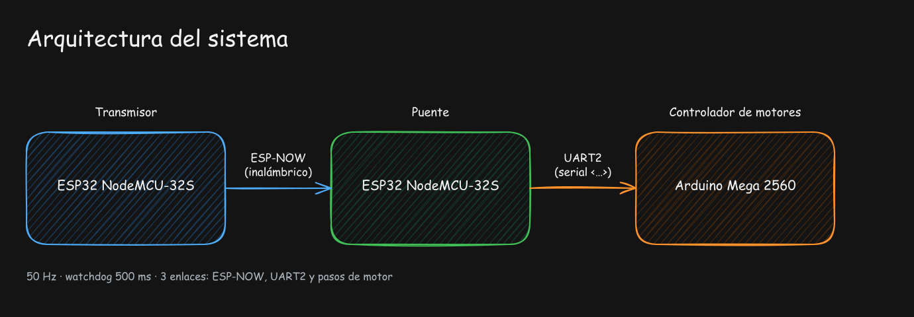

# Brazo Robótico MTDS — Firmware

> Repositorio de firmware del brazo robótico **MTDS**, un brazo de bajo costo para simulación de cirugía laparoscópica por teleoperación, desarrollado por un equipo universitario.

Este repositorio contiene el código para las **3 placas** que forman el sistema de control del brazo. No incluye el diseño mecánico ni el modelo 3D; acá vive únicamente el firmware (software embebido) que lo controla.

---

## 📌 Estado actual

El sistema usa una **teleoperación simple por ejes independientes**: cada eje de los joysticks mueve directamente un motor (o un servo) del brazo. **No hay cinemática inversa** en esta versión: el control por herramienta y la resolución del punto RCM (Remote Center of Motion) por software se desarrollan aparte.

Si no llegan comandos nuevos al Mega en **500 ms**, el sistema frena todo por seguridad (*watchdog*).

---

## 🧱 Arquitectura del sistema

Tres capas en cadena. El **control remoto** (transmisor) lee los joysticks, un **puente** (receptor) recibe la trama de forma inalámbrica y la reenvía por cable al **controlador de motores**, que mueve los actuadores.



El diagrama anterior se puede editar en Excalidraw (archivo fuente en [`docs/arquitectura.excalidraw`](docs/arquitectura.excalidraw)).

**Flujo de datos:**

1. El **Controller** lee los dos joysticks, el potenciómetro y los botones, y arma un paquete de datos.
2. Envía ese paquete al **Receiver** por **ESP-NOW** (protocolo inalámbrico punto a punto de Espressif), a **50 Hz**.
3. El **Receiver** reempaqueta los datos como texto `<vx1,vy1,vx2,vy2,pot,reset>` y los manda por **UART2** (serie) al **Mega**.
4. El **Mega** mueve los motores paso a paso (X, Y, Z) y los servos según esos valores.

---

## 🔌 Repositorio y entornos

El proyecto usa **PlatformIO**, y cada placa tiene su propio entorno (`env`) definido en `platformio.ini`. Cada entorno compila **solo** la carpeta que le corresponde gracias al filtro `build_src_filter`.

| Placa | Board | Entorno (`env`) | Carpeta de código | Protocolo de entrada |
|---|---|---|---|---|
| **Controller** — control remoto | ESP32 NodeMCU-32S | `controller` | `src/controller/` | Joysticks, potenciómetro, botones |
| **Receiver** — puente de comunicación | ESP32 NodeMCU-32S | `receiver` | `src/receiver/` | ESP-NOW |
| **Mega** — controlador de motores | Arduino Mega 2560 | `mega` | `src/mega/` | UART2 (parsing `<...>`) |

**Estructura del repo:**

```
robot-arm/
├── platformio.ini          # define los 3 entornos (3 placas)
├── src/
│   ├── controller/         # ESP32: control remoto (joysticks)
│   │   ├── controller.cpp
│   │   ├── Joystick.h
│   │   └── Joystick.cpp
│   ├── receiver/           # ESP32: puente ESP-NOW → UART2 al Mega
│   │   └── receiver.cpp
│   └── mega/               # Mega 2560: movimiento de motores y servos
│       └── mega.cpp
├── include/                # headers del proyecto (vacío por ahora)
├── lib/                    # librerías privadas (vacío por ahora)
└── test/                   # tests de PlatformIO (vacío por ahora)
```

**Dependencias** (resueltas automáticamente por `platformio.ini`):

- `arduino-libraries/Servo` — control de los servos en el Mega.

---

## ✅ Preparación (en la máquina al clonar)

### 1. Instalar PlatformIO

**Opción recomendada:** la extensión **PlatformIO IDE** para Visual Studio Code.

1. Instalá [Visual Studio Code](https://code.visualstudio.com/).
2. En VSCode, abrí la pestaña de **Extensiones** (ícono 🧩) y buscá **PlatformIO IDE** (`platformio.platformio-ide`).
3. Instalá la extensión y **reiniciá VSCode**.

   > El repo ya recomienda esta extensión en `.vscode/extensions.json`.

**Alternativa (CLI):** instalá el core de PlatformIO y usá los comandos `platformio` / `pio`:

```bash
pip install platformio
```

### 2. Instalar los drivers USB

Cada placa se conecta a la PC por USB y necesita su driver para aparecer como puerto serie (COM).

- **2× ESP32 NodeMCU-32S:** estos modelos son **clones que usan el chip CH340**. Necesitás el driver **CH340** de WCH.
- **Arduino Mega 2560:** usa un convertidor USB→serie (ATmega16U2). En Windows 10/11 instala solo (plug-and-play); solo en sistemas viejos hace falta el pack de drivers de Arduino.

> ⚠️ **Nota CH340:** las placas NodeMCU-32S de fábrica usan el chip **CP2102** (de Silicon Labs), pero muchos **clones usan CH340**. Como acá se usan clones, el driver es el **CH340**. Señal de que falla el driver: la placa se conecta por USB pero **no aparece ningún puerto COM** en el Administrador de dispositivos. Si te pasa, revisá qué chip tenés en la placa y bajá el driver correspondiente.

- Descarga oficial del driver **CH340** de WCH: <https://www.wch.cn/downloads/CH341SER_ZIP.html> (buscar la versión para el sistema operativo).

### 3. Abrir el proyecto

1. En VSCode, abrí la carpeta del proyecto: **File → Open Folder** y seleccioná la carpeta `robot-arm/`.
2. PlatformIO IDE detecta `platformio.ini` y listo.

> Cuando abrís el proyecto por primera vez, PlatformIO descarga automáticamente las plataformas (`espressif32`, `atmelavr`) y las dependencias. La primera compilación tarda unos minutos.

---

## 🚀 Compilar y subir el código

Con la extensión de PlatformIO instalada, cada entorno aparece en la **barra inferior de VSCode** (la barra azul). Ahí se elige el entorno y la acción.

### Seleccionar la placa (Build → entornos)

En la barra inferior, en el selector **`ENV:`**, elegí el entorno de la placa que querés trabajar: `controller`, `receiver` o `mega`.

### Íconos de acciones en la barra inferior

| Ícono | Acción |
|---|---|
| ✅ **Check** (`*`) | **Build / Compilar** el código del entorno actual |
| ➡️ **Flecha** (`→`) | **Upload / Subir** el firmware a la placa conectada |
| 🖥️ **Monitor** (`Serial Monitor`) | Abrir el puerto serie para ver el debug (115200 baud) |

Pasos típicos:

1. Conectá la placa por USB.
2. Elegí el entorno correcto con el selector `ENV:`.
3. Hacé clic en el **ícono de flecha (→) — Upload**. Compila y sube automáticamente.
4. (Opcional) Hacé clic en el **ícono de monitor** para ver la salida `Serial`.

### Orden recomendado de subida

Las 3 placas son independientes y se suben una por una, pero este orden evita confusiones con la comunicación:

1. **`mega`** — el controlador de motores.
2. **`receiver`** — el puente de comunicación (debe estar listo para recibir).
3. **`controller`** — el control remoto.

> **Equivalente por CLI:** cada acción de la extensión corresponde a `pio run -t upload -e <env>` y `pio device monitor -e <env>`.

---

## 🎮 Calibración y uso

Al conectar el **Controller**, los joysticks se **calibran solos** en el arranque (no los muevas durante ~0.5 s mientras muestra `Calibrando centro...`).

| Control | Efecto en el brazo |
|---|---|
| **Joystick superior — eje X** (`joy1X`) | Mueve el motor **X** |
| **Joystick superior — eje Y** (`joy1Y`) | Mueve el motor **Y** |
| **Joystick inferior — eje Y** (`joy2Y`) | Mueve el motor **Z** |
| **Joystick inferior — eje X** (`joy2X`) | Ajusta la **muñeca** (servo, incremental) |
| **Potenciómetro** | Abre/cierra la **pinza** (servo) |
| **Ambos botones de joystick a la vez** | Dispara el **home virtual** (busca el sensor de fin de carrera del eje X y define el cero) |

**Indicador LED (Controller):** el LED RGB muestra el estado del enlace ESP-NOW — **azul** = envío exitoso, **rojo** = fallo de entrega.

---

## ⚠️ Conexión y alimentación

> Estas son advertencias de seguridad eléctrica importantes. **No** las saltees.

1. **Regla de oro — nunca** conectar o desconectar un motor NEMA 17 con la fuente de **12 V encendida**. Induce picos de voltaje que destruyen el driver al instante.
2. **Orden de encendido seguro:**
   1. Primero conectá la **USB / lógica** (ESP32 + Mega).
   2. Verificá que aparezcan datos en el monitor serie.
   3. **Recién ahí** encendé la **fuente de 12 V**.
3. **Niveles de tensión:** el Mega trabaja a **5 V** y el ESP32 a **3.3 V**. En la línea de `TX` del Mega hacia el `RX` del ESP32 va un **divisor resistivo obligatorio** (ej. 1 kΩ + 2 kΩ) para no dañar el ESP32.
4. **Drivers DRV8825:** ajustar la corriente de referencia **Vref ≈ 0.84 V** para los motores NEMA 17 (1.68 A).
5. **Servos:** el **LM2596** (step-down) se ajusta a **6 V** para maximizar el torque del servo de la muñeca. El **GND** del LM2596 debe unirse al **GND** del Arduino.

---

## 📝 Notas del equipo

- **Dirección MAC del receptor (hardcodeada):** en `src/controller/controller.cpp` la dirección del receptor está fijada en el arreglo `receiverAddress`. Cada ESP32 tiene una MAC única; si se usa otra placa como receptor, hay que actualizar esa línea con la nueva MAC para que el enlace ESP-NOW funcione.
- **`git status` muestra archivos modificados sin haber tocado nada:** es el clásico problema de fin de línea (CRLF/LF) por trabajar desde Windows/OneDrive sin `.gitattributes`. No rompe nada, pero ensucia los diffs. Se resuelve agregando un `.gitattributes` con `* text=auto eol=lf`.

---
